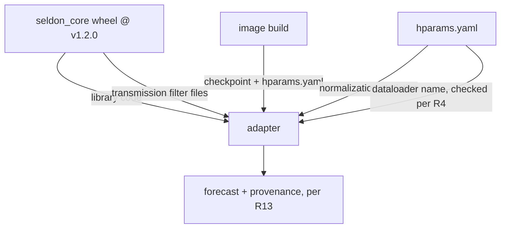
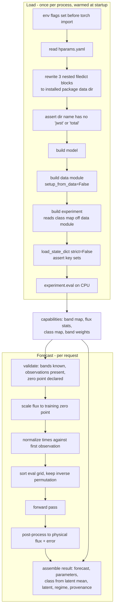

# Model Serving Foundation - Plan

## Goal Capsule

- **Objective:** A researcher's photometry can be turned into a SELDON forecast by a call that runs in an ordinary CPU container, with no HPC allocation, no CUDA device, and no training data on disk.
- **Product authority:** `STRATEGY.md`, specifically the Serving and operations track and the boundary that the model is consumed at a pinned release tag rather than evolved here.
- **Active scope:** The serving foundation only. The web interface, the REST API, the MCP interface, and the deployment repository are not active scope; each is separately plannable once this layer exists.
- **Means:** A thin adapter package inside a minimal Django service, importing `seldon_core` at a pinned tag and loading a checkpoint baked into the image (KTD1, KTD2).
- **Stop conditions:** Stop and report rather than working around it if the CPU spike (U1) cannot meet the 60-second bar, if the checkpoint's band vocabulary cannot be read without training data, or if `load_state_dict` reports missing keys outside the known aliasing.
- **Tail ownership:** This plan ends at a tested, importable adapter and a container that runs it. It opens no PR against `upstream` and performs no deploy.
- **Open blockers:** None. One load-bearing unknown is carried as the first unit: whether the latent neural-ODE path executes correctly and fast enough on CPU. U1 answers it before anything is built on top.

---

## Product Contract

_Preservation: changed - R5 (call shape widened to a sequence, user-directed this session) and R9 (stated rationale corrected: the returned class index is the echoed placeholder input, not a posterior sample; the prescribed fix is unchanged). Assumptions corrected for the same finding and for the class-count discrepancy. All other requirements, IDs, and Key Decisions carried forward unchanged._

### Summary

A thin adapter in this repository that loads a pinned SELDON checkpoint and returns forecasts on a caller-supplied evaluation grid, running CPU-only with no training data present. It ships with a test suite that pins the input handling, the output contract, and the checkpoint-compatibility guard.

### Problem Frame

SELDON's forecasts are reachable today only through a notebook written for a cluster. It defaults to a CUDA device, resolves the model directory and the training parquet files against absolute scratch paths, and depends on glue functions - the light-curve-to-tensor conversion, the batch stacking, the zero padding - that exist only in the notebook and in no released version of the library. A researcher who wants a forecast must therefore reproduce someone else's cluster environment before they can ask the question.

That gap is the whole cost. The people best positioned to act on a pre-peak forecast are advocating for time on another telescope, on a deadline, with a handful of early points. The notebook cannot serve them, and neither can a checkpoint sitting in a tarball. Everything above this layer - a web form, an API, an agent-invocable tool - is blocked on there being a callable, reproducible way to run the model at all.

The artifact itself is not the obstacle. The servable payload is 8 MB of weights plus a 30 KB `hparams.yaml`; the 88 MB tarball is mostly a TensorBoard events file. What stands in the way is that nothing packages those bytes with a library version, a device choice, and a documented call.

### Key Decisions

- **The adapter lives in this repository.** (session-settled: user-directed - chosen over contributing it upstream or vendoring the library: the glue functions exist only in the notebook, so there is nothing to import and nothing worth forking.) Governs R5, R6, R7, R9.
- **`seldon_core` is consumed at tag `v1.2.0`.** (session-settled: user-directed - chosen over `v1.1.1`, whose tree is identical but which declares `version = "1.1.0"` and is unreachable from `main`.) Governs R13.
- **The adapter returns every output family and lets the caller select.** (session-settled: user-directed - chosen over narrower contracts: a single forward pass computes all of them, so withholding one only forces a later surface to reopen this layer.) Governs R9.
- **The checkpoint is baked into the image.** (session-settled: user-directed - chosen over the sibling service's fetch-at-startup bucket pattern: 8 MB does not need that machinery, and the image tag then identifies model, library, and weights together.) Governs R12, R13.
- **The notebook is a guide, not a specification.** (session-settled: user-directed.) Its ordering defect is treated as a thing to avoid rather than a behavior to reproduce. Governs R6.
- **Classification is served, not deferred.** It is live in this checkpoint, and `STRATEGY.md` now records that it arrived as an upstream product rather than as future work. Governs R9.

### Requirements

**Loading and environment**

- R1. The adapter loads a forecast-ready model from a checkpoint directory containing `hparams.yaml` and a checkpoint file, with no light-curve training data present on disk and no reference to the paths recorded at training time.
- R2. Loading and inference run on CPU only. No code path requires a CUDA device or a GPU-tagged dependency.
- R3. The adapter resolves every training-time transmission-filter path recorded in `hparams.yaml` against the installed library's own data directory. These paths appear in four separate places - the top-level `transmission_filters` map and three nested `filedict` blocks under the dataset's band index map, the encoder's band embedding, and the decoder's bandpass embedding - and rewriting only the first leaves the remainder pointing at the training cluster.
- R4. The adapter rejects, with a clear error naming the incompatibility, any checkpoint whose recorded dataloader cannot accept normalization statistics supplied from `hparams.yaml`. Loading such a checkpoint would otherwise fail deep inside the loader with an unresolvable training-data path, an error that does not name the actual incompatibility.

**Forecast call**

- R5. The adapter accepts a sequence of objects. Each object carries observation times, flux, flux error, per-point detection flag, and per-point band, together with the caller's requested evaluation times and bands. A single-object forecast is the one-element case; batch throughput remains out of scope, but the signature does not have to be reopened to add it.
- R6. The evaluation grid is independent of the observation times. Requesting a forecast at times the object was never observed is the ordinary case, not an edge case.
- R7. The adapter accepts a caller-supplied zero point, either one value for the object or one value per observation, and scales each point's flux to the zero point the model was trained at.
- R8. A request that supplies no zero point is rejected with an error naming the omission, rather than being treated as already at the model's zero point. The model's zero point is not a safe default for photometry assembled from an arbitrary telescope, and a silent rescale would return a forecast wrong by orders of magnitude with nothing marking it. A caller whose flux genuinely is already in the model's system - simulated data, or the fixture R14 pins - may say so explicitly instead, and the adapter exposes the training zero point so that assertion can be checked rather than taken on faith. Omitting the zero point stays an error; declaring one, including declaring that it already matches, is a deliberate statement the caller is accountable for.
- R9. A forecast returns reconstructed flux with uncertainty on the requested grid, the interpretable basis parameters, the class prediction with probabilities, and the latent representation. The caller chooses which of these to read; the adapter computes them in one pass regardless. The class prediction and its probabilities are derived from the deterministic latent mean. They are not read from the class index the forward pass returns: that field is the caller-supplied placeholder label echoed back, not a prediction at all.
- R10. A forecast carries an indication of whether the request falls inside the regime the model was trained on, along three axes. The number of usable observations, compared against the training-time selection filter recorded in `hparams.yaml` - a light curve sparser than that filter is served with the indication set, never refused. The span of the requested evaluation grid, against the training-time time scale recorded in `hparams.yaml` - a value derived as the standard deviation of training light-curve spans and used as a normalization divisor, so a scale rather than a bound. This axis reports how far the request sits from a typical training span, not whether it crosses a trained-range boundary; treating it as a hard ceiling would mark ordinary-length light curves as extrapolation. And the requested bands: the checkpoint's band weights are infinite exactly where a band contributed no training observations, so a band carrying training support is distinguishable from one the model never saw. Most of this checkpoint's installed vocabulary falls in the latter group, which is why the band axis cannot be left out. Whether that travels as a per-point flag or a single summary is a planning decision; what this layer must not do is return an extrapolation shaped identically to a well-supported forecast. No surface above this one can add a caveat this layer never produced.
- R11. Photometry that fits the shape R5 names but that the checkpoint cannot serve is rejected with an error naming the reason, rather than returned as a forecast. Two conditions qualify: a band absent from the checkpoint's own band index map, whether that band appears in the observations or in the requested evaluation grid; and no usable observations at all. A sparse light curve is not one of them - it is served, with R10's indication set. The checkpoint's map is the authority here rather than the set of filter files the wheel installs, since the wheel ships files that are not model bands. The adapter is the only layer that knows this vocabulary, and the ingest-success-rate metric can only count failures this layer distinguishes.

- R17. Caller-supplied band names are matched against the checkpoint's vocabulary after normalizing single-character names to lower case, and matched as given otherwise. A name that does not resolve is rejected under R11 rather than guessed at. This rule decides which photometry the service can accept, so it is stated here rather than left to the validation step.

**Packaging and provenance**

- R12. The checkpoint and its `hparams.yaml` are present in the built image. Starting a container requires no network fetch of model weights.
- R13. A forecast can be traced to the library version, the checkpoint, and the training zero point that produced it.

- R18. The service runs locally through a container-based development environment, so a developer can start it and exercise a forecast without installing the model stack on the host.

**Test coverage**

- R14. A golden-output test pins the forecast for a fixed input light curve, so a library or checkpoint change that moves the numbers is visible.
- R15. A test covers an evaluation grid that differs from the observation times, both in values and in ordering.
- R16. A test covers the R4 rejection path, a further test covers the R8 rejection path for a request that omits the zero point, and a further test covers the R11 rejection path for photometry the checkpoint cannot serve.

The provenance chain the packaging requirements describe:

### Acceptance Examples

- AE1. Forecast beyond the observations
  - **Covers R6, R15.**
  - **Given:** an object with observations on nights 1 through 5.
  - **When:** a forecast is requested on a grid covering nights 6 through 20, supplied in an order that does not match the observation ordering.
  - **Then:** the returned flux corresponds to the requested times, each value aligned to the time it was asked for.

- AE2. Incompatible checkpoint
  - **Covers R4, R16.**
  - **Given:** a checkpoint whose `hparams.yaml` names a dataloader that computes normalization statistics from data rather than accepting them.
  - **When:** the adapter is asked to load it.
  - **Then:** loading fails with an error identifying the dataloader as the reason, rather than failing later with an unresolvable training-data path that does not name the incompatibility.

- AE3. Caller selects the output
  - **Covers R9.**
  - **Given:** a caller that wants only flux and uncertainty.
  - **When:** a forecast is requested.
  - **Then:** flux and uncertainty are available, and the basis parameters, class probabilities, and latent representation are present for a caller that wants them without a second call.

### Success Criteria

- A single-object forecast completes in under 60 seconds of wall clock on the target CPU container, measured over light curves spanning the expected range of point counts.
- The CPU spike returns a yes or no against that bar, not just a number. A measurement without a verdict does not close U1.
- A first-time reader can run the documented call against the built image and get a forecast without reading the adapter's source.

### Scope Boundaries

- The web interface, the REST API, and the MCP interface. This layer must be callable by all three, but building them is separate work.
- The deployment repository and its Helm chart.
- Retraining, fine-tuning, or any model evolution. The model is consumed at a tag.
- Ingest breadth beyond one object's photometry in the shape R5 names. Format coverage across instruments is its own track in `STRATEGY.md`.
- Batch throughput for triage across many candidates at once.

### Dependencies and Assumptions

- `seldon_core` at tag `v1.2.0` from the `Transient-Foundation-Model` repository. The tag is reachable from `main` and declares a matching version.
- A CPU build of the PyTorch and Lightning stack, which the library deliberately does not declare as a dependency.
- The normalization statistics travel inside `hparams.yaml` and are injected rather than computed. Verified for this checkpoint, which records `FlexibleLightCurveDataLoader`; it is not true of the sibling loader, which is why R4 exists.
- The transmission-filter data files are installed by the wheel rather than shipped separately. Verified: they sit inside the packaged library directory with no build exclusions. The wheel ships 47 files; the checkpoint's band index map enumerates 43 of them, and the remaining four are not model bands.
- Of the 43 bands in the vocabulary, only 12 carry finite training weight - six Roman filters and the six LSST filters. The other 31, including every JWST NIRCam filter, are in the vocabulary and will produce output, but the model never trained on them. This is the evidence R10's band axis reports.
- This checkpoint performs classification. Its variant name records it, and the class map and prediction path are populated.
- The model's training zero point of 27.5 mag is recorded in neither pinned artifact. It does not appear in `seldon_core` at `v1.2.0`, and `hparams.yaml` carries only a flux divisor rather than a magnitude zero point. The adapter therefore carries it as a named constant sourced from the author's notebook, which is why R13 records it alongside the library version and the checkpoint.
- The library compiles the model unconditionally at construction, in an autotuning mode, at three sites this checkpoint reaches: the ODE solver, the encoder it instantiates, and its `SpectrumBasisDecoder`. On CPU this produces long compiles or outright compilation failures, and the author's notebook disables compilation before importing. The adapter must either disable it or qualify a CPU-viable mode, and the latency measurement must state which it used - otherwise a failed CPU spike cannot be attributed to the neural-ODE path it is meant to test.
- Forecast output is deterministic in evaluation mode. The library draws a latent sample on every forward pass, but the value carried downstream is the latent mean whenever the module is not training, so the sample is unused. No seeding is required for reproducibility.
- The class index the forward pass returns is the caller-supplied placeholder echoed back, not a prediction, which is what R9 pins down. The placeholder is inert for reconstruction on this checkpoint because class-conditional decoding is disabled; U3 asserts that rather than assuming it, since a future checkpoint could enable it and silently condition every forecast on a dummy label.
- The checkpoint's class map names nine classes while the model head has ten outputs, and the probability vector spans all ten. The tenth is an unnamed negative-sample slot. The adapter drops it and renormalizes; this is recorded as an open question for the model's author.

### Outstanding Questions

**Blocking**

None.

**Deferred to implementation**

- Whether the latent neural-ODE path executes correctly on CPU and meets the 60-second bar. U1 answers it. A negative answer stops the plan rather than routing around it.
- The hard floor below which this checkpoint cannot produce a forecast at all. R11 rejects only on zero usable observations, which is safe but may be too permissive: the preprocessor asserts a minimum while assembling augmentation indices. U1 probes light curves of three, five, ten, and thirty points and reports the floor. Until it does, the conservative floor stands.

**For product strategy**

Resolved. `STRATEGY.md`'s Ingest and format coverage track now records that the checkpoint recognizes LSST, Roman, and JWST filter names only, that a relabelled band is undetectable, and that bandpass mapping for other instruments is that track's first problem. The Positioning bet is unchanged; the constraint is recorded where the work lives. U4's servable-band finding is the input that track will start from.

**For the model's author**

- The class map names nine classes while the model head has ten outputs and the probability vector spans all ten. The tenth appears to be an unnamed negative-sample slot left over from a class that produced no surviving training light curves. The adapter drops it and renormalizes. Confirm that is right rather than surfacing it.

### Sources

- `Tutorial.ipynb`, supplied by the model's author, sibling to this repository. The authoritative demonstration of the inference sequence, and the source of the glue functions the adapter replaces.
- `Transient-Foundation-Model` at `v1.2.0`: `TAE/datasets/lightcurve_dataloader2.py:77` declares the injectable normalization statistics, `:134` sets the already-set-up flag from the caller's choice, and `:250` is the branch that runs without data. `TAE/datasets/lightcurve_dataloader.py:340` is the sibling loader that computes those statistics from data instead, which R4 guards against.
- The checkpoint's `hparams.yaml` records the dataloader name, the normalization statistics including the time scale, the class map, and the training-time absolute paths that R3 rewrites.
- The sibling Astrodash service, whose layered domain and inference split, CPU-only torch install, and container tooling are the closest local precedent. Its fetch-at-startup weight delivery is the one pattern deliberately not followed here.

---

## Planning Contract

### Key Technical Decisions

- KTD1. **The adapter is a Django-free package under `app/seldon/infrastructure/ml/`, reached through an `@lru_cache` service seam.** (session-settled: user-directed - chosen over upstreaming or vendoring: the glue functions exist only in the notebook.) Governs R1, R2 - the placement and the cached seam are what make loading reachable without a request cycle. It instantiates the Product Contract decision that the adapter lives here, which governs R5, R6, R7, and R9. Mirrors the sibling Astrodash service, whose `infrastructure/ml/` imports no Django and whose `services.py` holds the factory functions. Keeps the adapter importable from a test, a management command, or a future MCP process without standing up a request cycle.
- KTD2. **The checkpoint is baked into the image and its path is a setting with an in-image default.** (session-settled: user-directed - chosen over fetch-at-startup: 8 MB does not need that machinery. Governs R12, R13.) This deletes the sibling service's entire startup-fetch path, its object-store client, its manifest, and the external data volume.
- KTD3. **The model loads once per process, cached in the adapter package, and is warmed from `AppConfig.ready()` behind a setting that defaults to off.** Astrodash defines a `warmup()` and never calls it, and documents the cost: the first request in each worker pays the load. With the checkpoint in the image there is no reason to inherit that - but `ready()` runs in every process that initializes the app registry, including the test runner and every management command, so the warmup is enabled in the server entrypoint only. Everything else loads lazily through the same cached seam. Governs the latency Success Criterion.
- KTD4. **Config surgery happens structurally on the in-memory config, never by rewriting a file.** The notebook rewrites `hparams.yaml` line-by-line into a fixed temporary path, which is not safe across concurrent workers. Governs R3.
- KTD5. **Filter paths are repointed at the installed package's own data directory, and the full resolved path is asserted to contain neither `jwst` nor `total` in any component.** The library's filter reader branches on those substrings appearing anywhere in the path string to decide wavelength units, so an ancestor directory - a home directory, a checkout, a mount point - corrupts every filter's wavelength scale as surely as the leaf would, and does it silently. Governs R3.
- KTD6. **Weights load through an explicit `torch.load(..., map_location="cpu")` plus `load_state_dict(strict=False)`, with the missing and unexpected key sets asserted against a known allowlist.** `strict=False` is genuinely required - the model aliases its class embedding under a second name - but accepting arbitrary missing keys in a service is how a randomly-initialized encoder ships. Governs R1, R2.
- KTD7. **`TORCH_COMPILE_DISABLE=1` and `MPLBACKEND=Agg` are set in the container environment, with the adapter package's `__init__` assignment kept as a backstop.** The library compiles at construction in six places, three of which this checkpoint reaches, and imports `matplotlib.pyplot` at module scope. Setting the flag after import is too late, and nothing in the plan controls which module imports torch first. Governs R2.
- KTD8. **The band vocabulary is read off the loaded model, never hardcoded.** Band indices are assigned by sorting the filter dictionary's keys alphabetically, so `r` is index 39, not 1. The library also ships a legacy hardcoded map that disagrees. Governs R10, R11.
- KTD9. **The evaluation grid is sorted with its own permutation, and the inverse is applied to the output.** This is the notebook defect the Product Contract names: it sorts the evaluation arrays with the observation ordering. Governs R6.
- KTD10. **Outputs are returned as a typed result object with per-object entries, not a dict of raw tensors.** Callers select fields; the adapter converts to plain Python and NumPy at the boundary so no caller holds a torch tensor. Governs R9.
- KTD11. **The golden-output test pins values with a tolerance set from the smallest change it must detect, and carries a self-guarding test asserting the enumerated fixture set matches the reference table.** Follows the Astrodash precedent, minus its download tag: our checkpoint is in the image, so the test runs everywhere. Governs R14.

### High-Level Technical Design

Load happens once per process; forecast happens per request. The two paths share only the cached experiment object.

The regime indicator (R10) is computed entirely from values read at load time, so it costs nothing per request.

### Sequencing

U1 gates everything. It is a throwaway spike whose only job is to answer the CPU question and report the observation-count floor. U2 stands up the service shell and the packaging that U1 proved viable. U3 through U7 build the adapter in dependency order. U8 closes the test contract.

### Assumptions

- The service targets Python 3.13 and Django 5.2, matching the sibling service.
- Inference is synchronous throughout. The sibling service's async-to-thread round trip is an artifact of its FastAPI origin and is not carried over.
- One worker process holds one loaded model. Admission control for concurrent multi-second forecasts is out of scope here and belongs with the HTTP surface.

### Risks and Dependencies

- **The ODE solve is the CPU hot spot, and masking does not save it.** The encoder gates each integration step with a `where` over both branches, so the solver runs for every consecutive observation pair regardless of the mask. Cost scales with observation count, not with the number of real points. If U1 misses the latency bar, capping the accepted observation count per object is the first lever - and that cap would be a new product constraint, so it returns to the Product Contract rather than being set in implementation.
- **The data module spawns a manager process on every construction.** The loader's `__init__` creates a `multiprocessing.Manager` unconditionally, and the resulting object is unused on the no-data path. Under a forking worker model this leaks a process per construction. KTD3's once-per-process cache contains it; a future code path that builds a second loader would reintroduce it.
- **`seldon_core` is a research codebase with a young release process.** The pinned tag exists and is reachable from `main`, but the tag immediately before it declared the wrong version and was cut from a feature branch. Treat a future tag bump as a change requiring the golden-output test to be re-recorded deliberately, not as a routine dependency update.
- **The checkpoint and the library are pinned independently.** Nothing in either artifact records which library version produced the checkpoint; the pairing is inferred from file timestamps. R13's provenance record makes the pairing explicit in output, but it does not validate it.
- **The sibling service is a pattern source, not a dependency.** Nothing here imports from it. Its conventions can drift without breaking this service, and its known gaps - an unrouted health check, a warmup that is never called - are ones this plan deliberately does not inherit.

---

---

## Implementation Units

### U1. Prove CPU viability and find the observation floor

- **Goal:** Answer whether the neural-ODE path runs correctly CPU-only within 60 seconds, and report the minimum observation count this checkpoint can actually serve.
- **Requirements:** R2, and the Success Criteria latency bar. Supplies the empirical answer R11's floor depends on.
- **Dependencies:** None.
- **Files:** `spikes/cpu_viability.py`, `spikes/Dockerfile.spike` (both throwaway; deleted in U2), `docs/solutions/ml-runtime/seldon-cpu-viability.md`.
- **Approach:**
  1. Build a minimal container using the same CPU-only torch install line U2 will use, and run the spike inside it under an explicit CPU limit. A measurement on the host does not transfer: torch sizes its thread pool to the visible cores, so an unconstrained workstation and a limited container are different machines.
  2. Load the checkpoint by the shortest path that works, following the notebook rather than the eventual adapter design.
  3. Time a forecast over light curves of 3, 5, 10, 30, 100, 256, and 400 points. The checkpoint records a training-time cap of 256 and nothing rejects a longer request, so the sweep must reach past it. Record the observation count at which the 60-second bar is crossed, if it is crossed.
  4. Time a padded multi-object batch mixing short and long light curves. The solver runs for every consecutive pair regardless of the mask, so each object in a batch pays the longest object's step count - and the sequence call is the primary shape.
  5. Split the recorded cost between checkpoint load and forward pass. That is the split the plan can act on; the per-output-family split is not, since R9 computes all families in one pass.
  6. Record the observed missing and unexpected state-dict key sets. U3's allowlist is built from this after key-by-key review, not from whatever the first successful load happens to produce.
  7. Record where it breaks for sparse input, which is the R11 floor.
  8. Record peak resident memory, which bounds how many workers a container can hold.
- **Execution note:** This unit is a probe, not a foundation. Write it to be thrown away. Its deliverable is the recorded finding, not the code.
- **Test scenarios:** None - this unit produces a measurement, not behavior. `Test expectation: none -- throwaway spike; its output is a recorded finding consumed by U2, U3, and U5.`
- **Verification:** A written finding states the container CPU limit and thread count it was measured under, the per-object latency for single objects and for a padded mixed batch, whether it clears 60 seconds, the observation count at which it stops clearing, the state-dict key sets, peak memory, and the observation floor. If the bar is missed, the plan stops here for a design decision rather than continuing. A floor above zero usable observations is a new product constraint: it returns to the Product Contract as an R11 amendment, the same way an observation-count cap would, and is not set quietly as a validation rule in U5.

### U2. Service skeleton and CPU-only packaging

- **Goal:** A Django project that builds into an image carrying CPU-only torch, `seldon_core` at the pinned tag, and the checkpoint.
- **Requirements:** R2, R12, R18.
- **Dependencies:** U1.
- **Files:** `app/manage.py`, `app/seldon_project/settings.py`, `app/seldon_project/urls.py`, `app/seldon_project/wsgi.py`, `app/seldon/__init__.py`, `app/seldon/apps.py`, `app/seldon/config/settings.py`, `app/seldon/views.py`, `app/requirements.txt`, `app/Dockerfile`, `docker/docker-compose.yml`, `docker/docker-compose.dev.yaml`, `env/.env.default`, `run/seldonctl`, `app/seldon/__init__.py`, `app/seldon/config/__init__.py`, `app/seldon/tests/__init__.py`, `app/seldon/tests/test_healthz.py`, `app/seldon/tests/test_packaging.py`.
- **Approach:**
  1. Mirror the sibling service's two-settings split: Django settings for the framework, a prefixed pydantic-settings class for everything model-related.
  2. Install CPU-only torch from the PyTorch CPU index before `requirements.txt`, pinned to an exact version, and keep torch out of `requirements.txt` so pip cannot resolve a CUDA build over it. The version is pinned for the same reason the library tag is: golden outputs are floating-point values that a runtime change can move. Record the resolved version in the provenance U4 builds.
  3. Set the compile-disable and matplotlib-backend flags in the container environment, not only in the package `__init__` (KTD7). A test or command that imports torch before the adapter would otherwise set them too late, and this unit's own CPU-only assertion test imports torch.
  4. Install `seldon_core` from a version-control requirement pinned to `v1.2.0`. The library publishes no package index release, and its repository is not anonymously readable, so the build authenticates through a mounted secret rather than a credential baked into a layer.
  5. Commit the checkpoint and its `hparams.yaml` to this repository and copy them into the image; the checkpoint-path setting defaults to that in-image location. At 8 MB the alternatives - large-file storage or a fetch into the build context - buy less than they cost, and committing is what makes the clean-checkout build claim true.
  6. Delete the U1 spike and its throwaway Dockerfile once its finding is recorded.
  7. Register a `/healthz` route whose readiness reflects model state: not ready until the checkpoint has loaded, and reporting the loaded library version and checkpoint identity once it has. A container that cannot load its checkpoint then fails visibly at rollout instead of accepting traffic and erroring on every request. The sibling service builds a health payload and never routes to it; a Kubernetes probe needs the route.
- **Patterns to follow:** `app/Dockerfile` and `app/astrodash/config/settings.py` in the sibling Astrodash repo. Do not copy its startup data-fetch, its object-store client, or its external data volume.
- **Test scenarios:**
  - `/healthz` returns success and reports the application version.
  - The installed torch build reports no CUDA availability, proving the CPU index was used, and reports the exact pinned version.
  - The container environment reports compilation disabled before any adapter import.
  - The checkpoint and `hparams.yaml` exist at the configured default path inside the built image.
  - `/healthz` reports not ready before the checkpoint loads and ready afterwards, naming the loaded library version and checkpoint.
  - A developer can start the local environment and reach the running service.
  - `requirements.txt` contains no unqualified `torch` entry.
- **Verification:** The image builds, the container starts, and `/healthz` answers.

### U3. Checkpoint loader with config surgery and compatibility guard

- **Goal:** A cached loader that turns a checkpoint directory into a ready experiment object on CPU with no training data present.
- **Requirements:** R1, R2, R3, R4.
- **Dependencies:** U1, U2. U1 supplies the state-dict key sets the allowlist is built from.
- **Files:** `app/seldon/infrastructure/__init__.py`, `app/seldon/infrastructure/ml/__init__.py`, `app/seldon/infrastructure/ml/loader.py`, `app/seldon/services.py`, `app/seldon/apps.py`, `app/seldon/tests/test_loader.py`.
- **Approach:**
  1. Set the compile-disable and matplotlib-backend flags in the package `__init__`, before any torch import (KTD7).
  2. Read `hparams.yaml`, then rewrite the three nested filter-dictionary blocks the factories actually read - under the dataset's band index map, the encoder's band embedding, and the decoder's bandpass embedding - to the installed package's data directory. The top-level filter map is dead at load time; rewrite it for provenance only. Assert that no component of the full resolved path contains either substring the library's unit-branching keys on (KTD4, KTD5).
  3. Force the no-data path, zero dataloader workers, and no pinned memory.
  4. Assign an empty band array before calling setup. The library's no-data branch does not set it and then reads it; this is a library defect, not a notebook shortcut.
  5. Build model, data module, and experiment through their three separate factories, in that order - the experiment reads the class map off the data module during construction.
  6. Load weights explicitly with a CPU map location and assert the missing and unexpected key sets against an allowlist committed as a literal in the loader (KTD6). That allowlist is the set U1 observed, after key-by-key review - not whatever the first successful load produces. Any key outside it fails the load. Assert class-conditional decoding is disabled, and assert torch reports compilation disabled.
  7. Guard R4 by reading `dataset.name`, which is the field the factories build from. Do not read `exp_params.config.params.dataset`: it records a second dataloader name, stale and unused at this tag, and in this checkpoint that name is the very sibling loader R4 exists to reject - so keying the guard on it makes the shipped checkpoint refuse itself. Raise a named error before the expensive steps above.
  8. Cache per process; warm from `AppConfig.ready()` (KTD3).
- **Test scenarios:**
  - Loading succeeds with no training data on disk and no network access.
  - Covers AE2. A checkpoint naming the incompatible sibling dataloader is rejected with an error naming the dataloader, not a missing-file error from deeper in the loader.
  - Every filter path in the surgically rewritten config resolves to an existing file inside the installed package.
  - A configured filter directory whose name contains `jwst` or `total` is refused at load.
  - An unexpected missing key in the state dict fails the load rather than warning.
  - A checkpoint whose stale `exp_params` dataloader name differs from `dataset.name` still loads, proving the guard reads the authoritative field.
  - A filter directory reached through an ancestor path containing `jwst` is refused, not only one whose leaf contains it.
  - Loading twice in one process returns the identical cached object.
  - The loaded model reports CPU device and evaluation mode.
- **Verification:** A test loads the baked-in checkpoint and reaches a ready experiment object in a container with no data volume mounted.

### U4. Capability introspection and provenance

- **Goal:** Read everything the adapter needs about the loaded checkpoint without running a forward pass.
- **Requirements:** R10, R13.
- **Dependencies:** U3.
- **Files:** `app/seldon/domain/__init__.py`, `app/seldon/domain/models/__init__.py`, `app/seldon/domain/models/capabilities.py`, `app/seldon/domain/models/provenance.py`, `app/seldon/infrastructure/ml/capabilities.py`, `app/seldon/tests/test_capabilities.py`, `docs/solutions/ml-runtime/seldon-servable-bands.md`.
- **Approach:**
  1. Expose the band vocabulary as an ordered name-to-index mapping read off the loaded data module (KTD8).
  2. Cross-check that the encoder-side and decoder-side band vocabularies match the data module's, and that the highest index fits the decoder's embedding. Three separately constructed objects agree only because the same filter dictionary was passed three times.
  3. Expose the normalization statistics, the time scale, the class map, and the per-band training weights. A band whose weight is infinite carried no training observations; that is the evidence R10's band axis reports.
  4. Build the provenance record: library version, checkpoint identity, the training zero point, and the resolved torch version. Torch belongs here because it is the runtime that produced the floating-point values a golden test pins.
  5. Record the servable band set as a finding: each of the checkpoint's band names mapped to the real instrument it denotes, marked by whether it carries training weight. This checkpoint knows LSST, Roman, and JWST filters only - no ZTF, ATLAS, Pan-STARRS, Swift, or Johnson-Cousins names - so what this layer can accept is a fact the surfaces above need before they are planned.
- **Test scenarios:**
  - The band vocabulary is alphabetical by filter name, and a spot-checked band resolves to the index the model actually uses rather than the library's legacy map.
  - The three band vocabularies agree, and a deliberately mismatched one is rejected.
  - Bands with infinite weight are reported as untrained, and the trained set is non-empty.
  - The provenance record names a library version, a checkpoint, a zero point, and a torch version, none of them empty.
  - Capability reads require no forward pass.
- **Verification:** Capabilities resolve from a freshly loaded model with no inference performed.

### U5. Request validation and the rejection contract

- **Goal:** Reject what the checkpoint cannot serve, with errors that name the reason.
- **Requirements:** R8, R11.
- **Dependencies:** U4.
- **Files:** `app/seldon/domain/models/request.py`, `app/seldon/domain/errors.py`, `app/seldon/infrastructure/ml/validation.py`, `app/seldon/tests/test_validation.py`.
- **Execution note:** Write the rejection tests first. Each is a one-line contract and they are the layer's only honest-failure guarantee.
- **Approach:**
  1. Reject a request that declares no zero point, per R8. Accept an explicit assertion that the photometry is already at the training zero point, and expose that zero point so the assertion is checkable.
  2. Reject any band absent from the checkpoint's vocabulary, whether it appears in the observations or the requested evaluation grid. The evaluation side matters: the band lookup runs over it too, and an unknown name there would otherwise surface as a bare key error.
  3. Reject an object with no usable observations. Do not reject on sparsity - that is R10's job, and rejecting it would refuse the user this service exists for.
  4. Apply the library's single-character lowercasing rule before lookup, so a caller passing `R` resolves the same as `r`.
  5. Give every rejection a stable machine-readable category code - unknown band, no usable observations, missing zero point, incompatible checkpoint - carried on the error itself. The ingest-success-rate metric is tallied by category above this layer, and R11 makes this the only layer that can tell these failures apart. Without a code the surfaces above either string-match messages or invent a taxonomy that drifts from this one.
- **Test scenarios:**
  - A request omitting the zero point is rejected, and the error names the omission.
  - A request asserting it is already at the training zero point is accepted.
  - An unknown band in the observations is rejected by name.
  - An unknown band in the evaluation grid alone is rejected by name.
  - An object with zero usable observations is rejected.
  - A three-point light curve in a known band is accepted, not rejected.
  - A single-character band name in upper case resolves.
  - Each rejection path raises its documented category code, and the codes are distinct.
- **Verification:** Each rejection path raises a distinct named error, and the sparse-but-valid case passes through.

### U6. Photometry-to-tensor adaptation

- **Goal:** Turn validated photometry into the exact tensors the model consumes.
- **Requirements:** R5, R6, R7.
- **Dependencies:** U5.
- **Files:** `app/seldon/infrastructure/ml/encoding.py`, `app/seldon/tests/test_encoding.py`.
- **Approach:**
  1. Scale each point's flux and flux error from the caller's zero point to the training zero point, accepting either one value per object or one per observation.
  2. Apply the checkpoint's own flux normalization to the rescaled flux and flux error, through the transform pipeline the loaded data module built from the recorded flux statistics. This is the semilog-then-max scaling the model was trained on; U7 inverts it when post-processing. Skipping it feeds the model flux in a scale it has never seen, and the failure is silent - the forecast comes back a plausible-looking number.
  3. Normalize times against the earliest observed time, divided by the checkpoint's time scale. Apply the same anchor to the evaluation grid so a grid extending before the first observation goes negative, which is legal.
  4. Sort observations by time; sort the evaluation grid with its own permutation and retain the inverse (KTD9).
  5. Build the six input fields the forward pass consumes, with the detection flag constrained to exactly zero or one - it indexes a two-row embedding, so any other value reads out of bounds.
  6. Stack a sequence of objects into a batch, padding shorter sequences and carrying a mask that marks real observations. Record each object's own observation and evaluation-grid lengths: the evaluation side carries no mask, and a padded band index is a legitimate band value, so only the recorded lengths let U7 trim each object's output back to what it asked for. Record the padding value used, since golden outputs depend on it.
- **Test scenarios:**
  - Covers R6, R15. An evaluation grid whose times and ordering both differ from the observations produces values aligned to the times requested, in the caller's original order.
  - Normalized flux round-trips through the transform pipeline's inverse back to the input value, proving the forward normalization is applied and matches what U7 inverts.
  - An evaluation grid shorter than the observation array does not raise, and does not silently mispair times with bands.
  - An evaluation grid extending before the first observation is accepted and yields negative normalized times.
  - A per-observation zero point array scales each point independently; a scalar scales all points equally.
  - A detection flag outside zero and one is rejected before reaching the model.
  - Two objects of different lengths stack into one batch, and the mask marks only real observations.
  - A one-element sequence produces the same tensors as the equivalent single object.
- **Verification:** Encoded tensors match expected shapes and dtypes, and a round trip through sorting and its inverse restores caller order.

### U7. Forecast execution and output assembly

- **Goal:** Run the forward pass and assemble the result object callers receive.
- **Requirements:** R9, R10, R13.
- **Dependencies:** U6.
- **Files:** `app/seldon/domain/models/forecast.py`, `app/seldon/domain/services/__init__.py`, `app/seldon/domain/services/forecast_service.py`, `app/seldon/infrastructure/ml/forecast.py`, `app/seldon/tests/test_forecast.py`.
- **Approach:**
  1. Run the forward pass under inference mode, then post-process reconstructed flux and its error back to physical units.
  2. Divide by the caller's zero-point scale factor so returned flux is in the caller's system, inverting what U6 applied.
  3. Derive the class prediction from the deterministic latent mean, not from the returned class index (R9). Drop the unnamed tenth output and renormalize.
  4. Compute the regime indicator on all three axes from values U4 already read.
  5. Trim each object's outputs back to its own evaluation-grid length, using the lengths U6 recorded when padding, before applying the inverse permutation. Without the trim each object receives another object's padding as if it were forecast points, and the evaluation side carries no mask to distinguish them.
  6. Assemble a typed per-object result carrying forecast, parameters, class probabilities, latent, regime indicator, and provenance. Each result records the zero point its flux is expressed in: a sequence call can mix zero points across objects, and fluxes on different magnitude scales are not comparable without it. Convert off torch tensors at the boundary (KTD10).
- **Test scenarios:**
  - Covers AE3. A caller reading only flux and uncertainty gets them, and the other families are present without a second call.
  - Two identical requests return identical class predictions.
  - The returned class probability vector sums to one and carries only named classes.
  - Returned flux is in the caller's zero-point system, not the training system.
  - A sparse light curve returns a forecast with the regime indicator set, not a rejection.
  - A request in an untrained band returns a forecast with the band axis flagged.
  - Two objects with evaluation grids of different lengths each return exactly the points they asked for, with no padding leaking between them.
  - Two objects submitted with different zero points each report the zero point their own flux is expressed in.
  - Every result carries a provenance record.
  - No returned field is a torch tensor.
- **Verification:** A forecast on the baked-in checkpoint returns a complete result object within the latency bar.

### U8. Golden-output test and regression suite

- **Goal:** Pin the numbers so a library or checkpoint change that moves them is visible.
- **Requirements:** R14, R16. R15 is discharged by U6, which owns the evaluation-grid independence test.
- **Dependencies:** U7.
- **Files:** `app/seldon/tests/fixtures/reference_light_curves.py`, `app/seldon/tests/test_reference_outputs.py`, `docs/developer/regenerating-reference-outputs.md`.
- **Approach:**
  1. Record reference outputs for a small fixed set of light curves, documenting how they were produced and against which library tag and checkpoint.
  2. Assert within a documented tolerance rather than exact equality. Set the tolerance from the smallest numeric change R14 must catch, not from the observed run-to-run spread: output is deterministic in evaluation mode, so that spread is float noise and says nothing about what size of real change the test should detect. Record both bounds - the spread it must exceed, and the change it must still catch (KTD11).
  3. Add a self-guarding test asserting the enumerated fixture set matches the reference table, so the suite cannot pass vacuously when a fixture is removed.
  4. Consolidate the rejection-path tests R16 names.
- **Patterns to follow:** `app/astrodash/tests/test_quoin_reference_outputs.py` in the sibling repo. Drop its download tag and skip guard - our checkpoint is in the image, so the test runs everywhere, which is strictly better.
- **Test scenarios:**
  - Covers R14. Each reference light curve reproduces its recorded flux within tolerance.
  - The enumerated fixture set equals the reference table, and removing a fixture fails the suite.
  - Covers R16. The three rejection paths - incompatible checkpoint, missing zero point, unservable photometry - each raise their named error.
  - The recorded tolerance is wider than the observed run-to-run spread.
  - A deliberately perturbed reference value fails the comparison, proving the tolerance is bounded above and the test has defined sensitivity.
- **Verification:** The full suite passes in the container with no data volume and no network.

### U9. Usage documentation

- **Goal:** A first-time reader can run a forecast against the built image without reading the adapter's source.
- **Requirements:** The documented-call Success Criterion, which no other unit delivers.
- **Dependencies:** U7. U8 may run in parallel.
- **Files:** `README.md`, `docs/guides/running-a-forecast.md`.
- **Approach:**
  1. Document the call: what a caller supplies, what comes back, and which fields carry the regime indicator and the provenance record.
  2. Work one example end to end against the baked-in checkpoint, with real numbers a reader can reproduce.
  3. State the rejection contract - the four category codes from U5 and what each means for a caller.
  4. State the servable band set, citing the finding U4 records, so a reader learns before submitting that this checkpoint knows LSST, Roman, and JWST filters only.
- **Execution note:** Write this against the built image as a reader would, not from the source. A document written from the code tends to describe what the code does rather than what a caller needs.
- **Test scenarios:**
  - The worked example runs as written against the built image and produces the documented output.
- **Verification:** Someone who has not read the adapter's source follows the document and gets a forecast.

---

## Verification Contract

| Gate | Command | Applies to |
|---|---|---|
| Test suite | `coverage run manage.py test seldon.tests -v 2` from `app/` | U2-U8 |
| Coverage report | `coverage report -i --omit=seldon/tests/*,seldon_project/*,manage.py` | U2-U8 |
| Formatter | `black app/` | U2-U8 (U1's spike is throwaway and deleted in U2) |
| Image build | `run/seldonctl slim_dev up` builds and starts the stack | U2, and re-run at U8 |
| CPU-only proof | Test asserts the installed torch reports no CUDA availability | U2 |
| Latency bar | Per-object wall clock under 60 seconds, measured on a padded batch of mixed lengths inside the container at its pinned CPU limit - not on single objects on the host | U1, U7 |
| No-data proof | Suite passes with no data volume mounted and no network | U3, U8 |
| Documented call | The worked example in the usage guide runs as written against the built image | U9 |

The latency bar is the plan's sharpest exit criterion. Treat a measured value above 60 seconds as a stop-and-report, not a tuning task.

---

## Definition of Done

**Global**

- A documented call loads the baked-in checkpoint and returns a forecast in a CPU-only container with no training data present and no network access.
- Every requirement R1 through R16 is either implemented and covered by a test, or explicitly recorded as deferred with a reason.
- The full test suite passes and the image builds from a clean checkout.
- `black` reports no changes.
- The throwaway spike from U1 is deleted, and its finding is recorded under `docs/solutions/`. No dead-end or experimental code from abandoned approaches remains in the diff.
- The class-count question is either answered by the model's author or carried forward as a recorded assumption; it does not silently disappear.
- The servable band set is recorded, and U4's finding is handed to the ingest track `STRATEGY.md` now names as owning bandpass mapping.
- A reader who has not seen the source can follow the usage guide and get a forecast.

**Per unit**

Each unit is done when its test scenarios pass, its verification statement holds, and the requirements it cites are satisfied. U1 is the exception: it is done when its finding is written and the latency verdict is recorded, whichever way that verdict falls.
